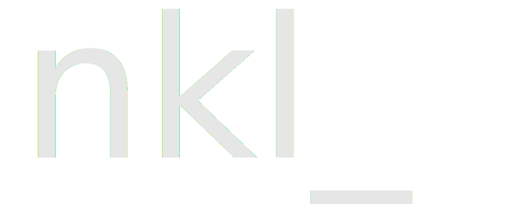

<p align="center">
    
</p>

[](https://github.com/nickl-lang/nickl/actions/workflows/ci.yml)

# The Nickl Programming Language

> **WARNING:** The project is in the research/prototype phase. Expect things to not work!

Nickl is a programming language that is a part of the research project focused on language design
and exploring the boundaries of what can be done in low-level language compiler.

# Building from source

Nickl build scripts are using docker to implement reproducible builds.

Currently following platforms are supported:
- Linux
- Windows (MinGW-w64)

## Build dependencies

- `docker.io`

## Build

Before starting the build, make sure that docker is installed and your user is in the `docker` group:
```
$ sudo usermod -aG docker $USER
$ newgrp docker
```

To build the Nickl compiler, simply run the build script, it will download the required containers
```
$ ./build.sh
```

> TODO: Make `test` command automatically build tests

Other possible build targets are:
```
$ ./build.sh test
$ ./build.sh install
$ ./build.sh package
```

# Building from source (without docker)

> TODO: Implement native build option  
> TODO: Make ninja optional  
> TODO: Fix native build without profiler  
> TODO: Specify Ubuntu 20.04 commands?  
> TODO: Describe cross-compilation

## Build dependencies

- `cmake`
- `libffi-dev`
- `ninja-build` (optional)
- `ccache` (optional)

## Build dependencies (Windows)

- `g++-mingw-w64-x86-64`

## Test dependencies

- `libjson-c-dev`
